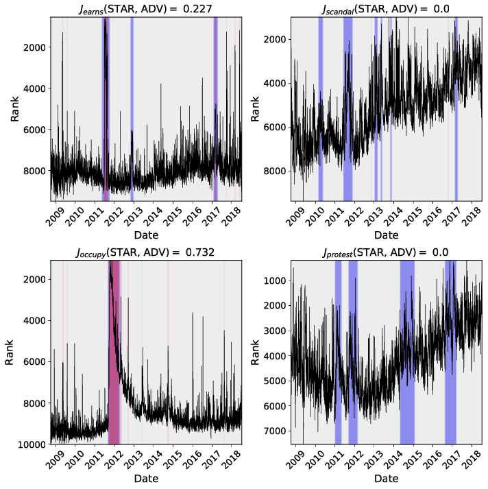
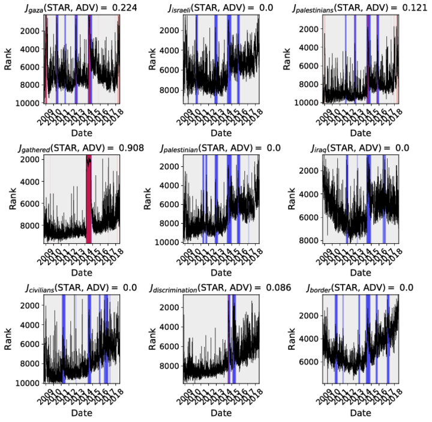
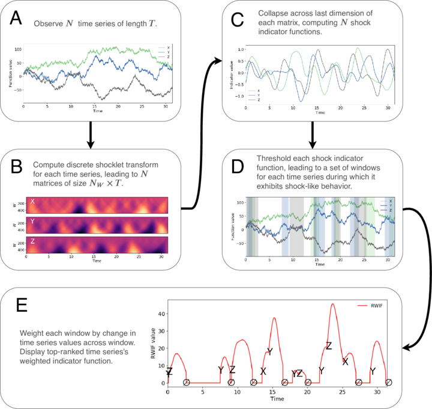

We created the first-ever qualitative, shape-based, functional anomaly detection algorithm for time series:
the STAR (Shocklet Transform and Ranking) algorithm. Using this methodology, you can analyze high-dimensional
time series data, find period of time in which they displayed anomalous behavior, and distill coherent, human-understandable narratives from them, all without any off-line training. We have successfully used this algorithm to: 

+ generate social timelines from terabytes of social media data;
+ classify periods of financial market instability; and
+ generate document-free topic networks from natural language data.

Our algorithm compares favorably with Twitter's anomaly detection algorithm for uncovering spiky dynamics over
short time intervals, but unlike this and other anomaly detection algorithms, 
STAR can pull out long-term, shock- and cusp-like dynamics.
These dynamics often correspond to important social and economic movements, such as the Occupy Wall Street protests of 2010...

 

...or Israeli-Gaza conflict of 2014...

Each panel shows the time series of that word's popularity on Twitter.
Red highlights Twitter's anomaly detection algorithm indicators, while STAR-indicated anomalies are in blue.
It's clear that **STAR is able to find functionally-meaningful anomalies over a wide range of timescales**. 

Please contact <star@sociotechnicalsignals.com> for more information.

### Technical overview

Since pictures are worth \\( N \geq 1000 \\) words...

### Social media

The mathematical machinery underlying this algorithm - the so-called "shocklet transform" - 
got some love on Twitter.

<blockquote class="twitter-tweet">
The shocklet transform: A decomposition method for the identification of local, mechanism-driven dynamics in sociotechnical time series  “filter high-dimensional data and automate the extraction of anomalous behavior”   <a href="https://t.co/c5C59Q4utU">https://t.co/c5C59Q4utU</a> <a href="https://t.co/XhGk3P8htb">pic.twitter.com/XhGk3P8htb</a>
&mdash; Alessandro Vespignani (@alexvespi) <a href="https://twitter.com/alexvespi/status/1144515989373116416?ref_src=twsrc%5Etfw">June 28, 2019</a></blockquote> 

<blockquote class="twitter-tweet">
&quot;Discrete Shocklet Transform&quot;, very cool work regarding identification of patterns and local dynamics on frequency-dependent time series. <a href="https://twitter.com/uvmcomplexity?ref_src=twsrc%5Etfw">@uvmcomplexity</a> <a href="https://t.co/NJdPuwYRKO">https://t.co/NJdPuwYRKO</a>
&mdash; Alfredo González-Espinoza (@Spiralizing) <a href="https://twitter.com/Spiralizing/status/1147213062622945280?ref_src=twsrc%5Etfw">July 5, 2019</a></blockquote> 

<blockquote class="twitter-tweet">
Shocklet transform by <a href="https://twitter.com/d_r_dewhurst?ref_src=twsrc%5Etfw">@d_r_dewhurst</a> et al<a href="https://twitter.com/ChrisDanforth?ref_src=twsrc%5Etfw">@ChrisDanforth</a> <a href="https://twitter.com/peterdodds?ref_src=twsrc%5Etfw">@peterdodds</a> [shock / cusp post-facto detection of endogenous dynamics in socio-technical time series, git <a href="https://t.co/XM5ysbRgCf">https://t.co/XM5ysbRgCf</a> ; EGG <a href="https://t.co/jE9zsO86tg">https://t.co/jE9zsO86tg</a> ; Sornette <a href="https://t.co/4tMfVLxbVd">https://t.co/4tMfVLxbVd</a> ] <a href="https://t.co/LbCryRp0RQ">https://t.co/LbCryRp0RQ</a> <a href="https://t.co/WBxPskpovN">pic.twitter.com/WBxPskpovN</a>
&mdash; Daniel Bilar (@daniel_bilar) <a href="https://twitter.com/daniel_bilar/status/1155567820371058688?ref_src=twsrc%5Etfw">July 28, 2019</a></blockquote> 
