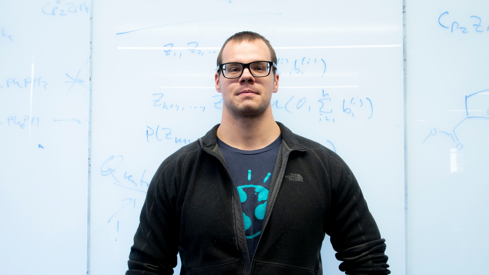

David Dewhurst is the founder of Sociotechnical Signals. He invented the STAR functional anomaly detection 
algorithm, develops Sociotechnical Signals's financial market agent-based model, 
and is an expert in time series modeling and prediction.
He has authored [numerous scientific papers](https://davidrushingdewhurst.com/papers/) 
on topics ranging from time series and nonequilibrium statistical mechanics to social media and game theory.

In the past, David worked at the [MITRE Corporation](https://www.mitre.org/) and at a variety of economic policy organizations. 
He obtained a PhD in Data Science, an MS in mathematics, and a BA in economics, mathematics, and political science at the [University of Vermont](http://vermontcomplexsystems.org/).

You can contact David directly at <drd@sociotechnicalsignals.com>.

